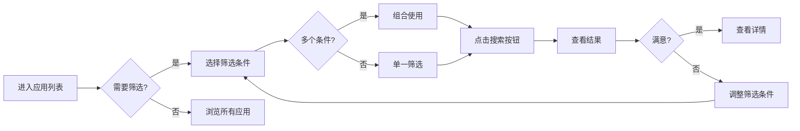

# 搜索和筛选功能使用指南

本文档说明应用列表页面的搜索和筛选功能。

## ✨ 功能特性

### 1. 关键词搜索 🔍

- **搜索范围**: 应用名称、应用描述
- **搜索方式**: 
  - 输入关键词后按 **Enter** 键
  - 或点击右侧的 **"搜索"** 按钮
- **实时清除**: 点击输入框中的 ❌ 图标可快速清除搜索内容

**示例**:
- 搜索 "shipfast" 会找到 ShipFast 应用
- 搜索 "开发者" 会找到所有描述中包含该词的应用
- 搜索 "ai" 会找到所有AI相关应用

### 2. 分类筛选 📁

- **功能**: 按应用分类筛选
- **方式**: 下拉选择分类
- **实时生效**: 选择后立即应用筛选

**可用分类**:
- 营销与增长工具
- 开发者工具与教育
- AI与内容生成
- 电商与支付
- 垂直细分市场
- 商业服务平台
- 社区与会员平台
- 金融科技与交易
- 基础设施与技术服务
- 其他应用

### 3. 排序方式 ⬆️⬇️

- **排名升序**: 按 TrustMRR 排名从低到高
- **收入降序**: 按总收入从高到低
- **MRR 降序**: 按月度经常性收入从高到低
- **推荐度降序**: 按独立开发者推荐度从高到低

**实时生效**: 选择后立即重新排序

### 4. 收入范围筛选 💰

- **$0 - $200K**: 小型项目
- **$200K - $500K**: 中型项目
- **$500K - $1M**: 成功项目
- **$1M - $5M**: 大型项目
- **$5M+**: 超大型项目

**使用方式**:
1. 选择收入范围
2. 点击"搜索"按钮应用筛选

### 5. 组合筛选 🎯

可以同时使用多个筛选条件：

**示例 1**: 找高收入的 AI 应用
- 关键词: "ai"
- 收入范围: $1M - $5M
- 点击"搜索"

**示例 2**: 找推荐度高的开发者工具
- 分类: 开发者工具与教育
- 排序: 推荐度降序

**示例 3**: 搜索特定关键词并按收入排序
- 关键词: "saas"
- 排序: 收入降序

### 6. 活动筛选器显示 🏷️

- 当应用筛选条件时，会在搜索栏下方显示当前活动的筛选器
- 每个活动筛选器都可以单独点击 ❌ 快速移除

**示例显示**:
```
当前筛选:
[关键词: shipfast ❌] [分类: 开发者工具 ❌] [收入范围: $1M-$5M ❌]
```

## 🎮 使用技巧

### 快捷键

- **Enter**: 执行搜索
- **点击筛选器标签的 ❌**: 快速移除该筛选条件

### 最佳实践

1. **从宽到窄**: 先选择分类，再搜索关键词
2. **善用排序**: 找到目标应用后按需排序
3. **清除筛选**: 使用标签上的 ❌ 快速调整筛选条件
4. **收入筛选**: 根据自己的目标选择合适的收入范围

### 搜索示例场景

#### 场景 1: 我想找月收入稳定的 SaaS 应用

1. 排序选择: **MRR 降序**
2. 查看结果

#### 场景 2: 我想找适合独立开发者的项目

1. 排序选择: **推荐度降序**
2. 查看推荐理由和技术难度

#### 场景 3: 我想找特定领域的成功案例

1. 分类: 选择目标分类
2. 收入范围: **$500K - $1M**
3. 查看结果

#### 场景 4: 我想找某个特定应用

1. 关键词: 输入应用名称
2. 按 **Enter** 或点击 **"搜索"**

## 🔄 筛选流程



## 💡 常见问题

### Q: 为什么搜索没有结果？

**A**: 检查以下几点：
1. 关键词拼写是否正确
2. 是否选择了过于严格的筛选条件
3. 尝试清除部分筛选条件
4. 尝试更宽泛的关键词

### Q: 分类和排序会同时生效吗？

**A**: 是的！所有筛选条件都可以组合使用：
- 分类筛选限定应用范围
- 排序决定显示顺序
- 关键词搜索在筛选后的结果中查找
- 收入范围进一步限定结果

### Q: 如何重置所有筛选？

**A**: 有两种方式：
1. 点击每个活动筛选器标签上的 ❌
2. 刷新页面

### Q: 搜索是否区分大小写？

**A**: 不区分！搜索是大小写不敏感的。
- "AI" 和 "ai" 会得到相同结果

### Q: 搜索是否支持多个关键词？

**A**: 是的！使用空格分隔多个关键词：
- "ai saas" 会搜索包含这些词的应用

## 📊 统计信息

搜索结果页面底部会显示：
- 找到的应用总数
- 帮助你了解筛选效果

## 🚀 未来计划

可能添加的功能：
- [ ] 保存常用筛选组合
- [ ] 高级搜索（多字段精确匹配）
- [ ] 按标签筛选
- [ ] 按技术栈筛选
- [ ] 按推荐度星级筛选

---

**享受搜索和筛选功能！** 🎉

如有问题或建议，欢迎反馈！

